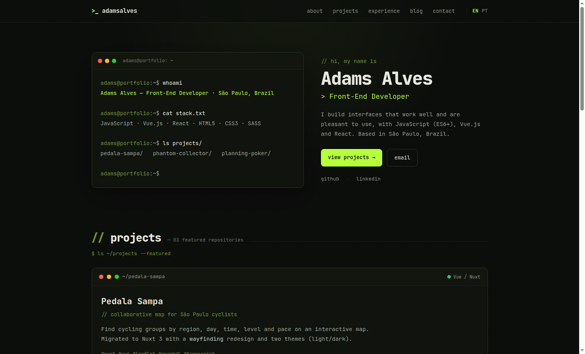

# Terminal Mono — Hugo theme

Personal **dark / monospace** theme for portfolio + blog. Typing terminal hero, repository-style project cards, a blog with a reading-progress bar, tag pages and a 404 — all in the same aesthetic. **No third-party JS dependencies.**



**[Live demo →](https://adamsalves.github.io/terminal-mono/)** — the screenshot above is
the bundled `exampleSite/`, which is exactly what the demo serves.

- 🎨 Dark-only, JetBrains Mono, lime accent — all driven by CSS variables.
- ⌨️ Hero terminal with a typewriter effect (degrades gracefully without JS).
- 🗂️ Portfolio content 100% from `params` — no template editing.
- ✍️ Full blog: paginated list, post with TOC, tag pages and sharing.
- ⚡ Hugo asset pipeline (minify + fingerprint + SRI in production).
- 🔤 **JetBrains Mono is self-hosted** — no Google Fonts, no `preconnect`, nothing render-blocking from another origin.
- 🔎 SEO ready: Open Graph, Twitter Card, JSON-LD, RSS and `canonical`.
- 🤖 **AEO ready**: `robots.txt` with a `Sitemap:` line and named groups for the AI crawlers,
  `Person`/`Organization`, `WebSite`, `BlogPosting` and `BreadcrumbList` structured data, and
  `llms.txt`, `llms-full.txt` and a markdown twin per post — all per language, all in Hugo templates.
- ♿ Accessible: "skip to content" link, visible focus and `prefers-reduced-motion`.
- 🌍 Multilingual via Hugo i18n — **English + Portuguese** included, with a language switcher and localized dates. Any other language falls back to English rather than rendering blank labels.

Requires **Hugo extended ≥ 0.158**.

## Preview (exampleSite)

The theme ships with a ready-to-run example site:

```bash
cd exampleSite
hugo server --themesDir ../..
```

Open <http://localhost:1313>. The `exampleSite/hugo.toml` documents **every** available `param`.

## Installation

### Via Hugo Modules (recommended)

```bash
hugo mod init github.com/your-name/your-site   # if you don't use modules yet
hugo mod get github.com/adamsalves/terminal-mono
```

```toml
# hugo.toml
[module]
  [[module.imports]]
    path = "github.com/adamsalves/terminal-mono"
```

### Via Git submodule

```bash
git submodule add https://github.com/adamsalves/terminal-mono themes/terminal-mono
```

```toml
# hugo.toml
theme = "terminal-mono"
```

### Manual copy

Copy the folder into `themes/terminal-mono/` and set `theme = "terminal-mono"` in your config.

## Structure

```
terminal-mono/
  theme.toml                 # theme metadata
  hugo.toml                  # theme config: the module mounts (see Languages)
  assets/
    css/terminal.css         # styles (pipeline: minify + fingerprint)
    js/terminal.js           # menu, progress bar, typewriter
  layouts/
    index.html               # home (portfolio)
    index.llms.txt           # /llms.txt — the AEO index (needs [outputs])
    index.llmsfull.txt       # /llms-full.txt — every post's markdown
    404.html
    robots.txt               # AI-crawler groups + Sitemap (needs enableRobotsTXT)
    _default/
      baseof.html  list.html  single.html  term.html  terms.html
      single.markdown.md      # each post's markdown twin, next to its HTML
      _markup/                # render hooks (heading, image, link)
    partials/
      head.html  schema.html  nav.html  footer.html  lang-switch.html
      hero.html  projects.html  about.html  experience.html  contact.html
      post-card.html  pager.html
  i18n/                      # en.toml (default + fallback for every language), pt.toml
  static/
    favicon.svg              # + one per palette (amber, cyberpunk, ice, mono)
    fonts/                   # JetBrains Mono, self-hosted (latin + latin-ext) + OFL.txt
  archetypes/                # default.md, blogs.md
  exampleSite/               # bilingual demo site + commented config
```

## Content (all via `params`)

| Section | Params |
|---|---|
| Brand/nav | `params.title`, `params.navbar.brandName`, `params.navbar.showBlog` (optional), `params.terminalUser`; the nav links **and** the section order come from [`[[menu.main]]`](#the-menu-and-the-sections) (optional) |
| Hero | `params.hero.intro/subtitle/location/content`, `params.hero.socialLinks.fontAwesomeIcons[]` |
| Hero — terminal | builds "whoami / cat stack.txt / ls projects/" from `title`, `subtitle`, skills and projects; adds [`ls ~/blog --latest`](#latest-posts-in-the-hero-terminal) when the language has posts — `params.hero.latestPosts` (optional, default 3). Each command follows the section that owns its data, so a command with nothing to print is not typed at all — `whoami` excepted, which always runs: `cat stack.txt` needs `about` to render **and** `skills.enable = true`, `ls projects/` needs `projects` to render (see [the menu and the sections](#the-menu-and-the-sections)) |
| Projects | `params.projects.items[]` → `title`, `repo`, `language`, `tagline`, `content`, `badges[]`, `featured{name,link}`, `links[]{icon,url,name}`; `params.projects.enable` (optional) |
| About + skills | `params.about.content` (markdown), `params.about.skills.items[]` gated by `params.about.skills.enable` (required — an absent key counts as off, and silences the hero's `cat stack.txt` with the block); `params.about.enable` (optional — the section, not the skills block) |
| Experience | `params.experience.items[]` → `company`, `jobs[]{name, date (optional), content}`; `params.experience.enable` (optional) |
| Contact | `params.contact.title/content/btnName/btnLink`; `params.contact.enable` (optional) |
| Footer | `params.footer.copyright`, `params.footer.socialNetworks.github/linkedin` |
| Blog | `content/blogs/*.md` → `title`, `date`, `tags`, `description`, `image` (optional), `toc` |
| Colors | `params.theme.palette` (optional, default `lime`) and `params.theme.colors.*` (optional) — see [Colors](#colors) |
| Fonts | `params.fonts.latinExt` (optional, default `false`) — see [Fonts](#fonts) |

### Latest posts in the hero terminal

Once a language has published posts, the hero terminal types a fourth command
and lists the newest ones:

```
robin@portfolio:~$ ls ~/blog --latest
2026-03-12  migrating-trailhead-to-nuxt-3.md
2026-02-27  a-chiptune-with-the-web-audio-api.md
2026-02-08  planning-poker-with-socket-io.md
```

Each filename is a link to the post. There is nothing to switch on — the listing
appears when posts exist and disappears when they don't. Posts are ordered by
date, newest first, regardless of any `weight` you set.

**The names follow the reader's language.** They are built from each post's
title, not from its file on disk — `post.md` and `post.pt.md` share a filename,
so a Portuguese reader would otherwise get an English listing. Accents are kept
(`programação-e-café.md`), and the post's real title is the link's accessible
name for screen readers. The `~/blog/….md` label on the blog cards is built the
same way, from the same partial, so the two can never disagree; in the terminal
the name is shortened to keep the listing in one column.

`params.hero.latestPosts` sets how many to show (default `3`); `0` drops the
command entirely. Set it under `[params.hero]` for the whole site, or under
`[languages.<lang>.params.hero]` to vary it per language.

Links become clickable as each name finishes typing. Readers with
`prefers-reduced-motion` get the whole terminal, links included, immediately.

### The menu and the sections

`[[menu.main]]` is the page's index. It sets the order of the nav links **and**
the order the home page renders its sections in — one list, so the two can never
disagree about what the page contains.

A section renders when all three of these say yes:

| Gate | Where it lives | A section loses it when |
|---|---|---|
| The switch | `[params.<section>] enable` | you set it to `false` |
| The index | `[[menu.main]]` (or `params.sections.order`) | its block is not there |
| The content | the section's own params | you filled nothing in |

The four sections are `about`, `projects`, `experience` and `contact`. The hero
is the page's header rather than a section: always first, not movable, not
removable. Any other identifier — `blog`, an external link — is nav-only.

"Content of its own" means:

| Section | Has content when |
|---|---|
| `about` | `content` is set, or `skills.enable` with a non-empty `skills.items` |
| `projects` | `items` is not empty |
| `experience` | `items` is not empty |
| `contact` | any of `title`, `content`, `btnLink` |

The built-in translations dress a section; they do not justify one. So a site
that fills nothing in gets no sections — and no links pointing at them, which is
the whole point: a link to a section that does not render is a dead link.

#### 1. Order — the nav and the page, together

Hugo's native menu, sorted by `weight`:

```toml
[[menu.main]]
  identifier = "projects"
  url = "#projects"     # anchors resolve against the language's home
  weight = 10
[[menu.main]]
  identifier = "about"
  url = "#about"
  weight = 20
[[menu.main]]
  identifier = "blog"
  pageRef = "/blogs"    # nav-only: the blog is not a section
  weight = 30
[[menu.main]]
  identifier = "contact"
  url = "#contact"
  weight = 40
```

The home page now renders `projects`, `about`, `contact` in that order, and the
nav lists them with the blog in between.

Omit `[[menu.main]]` entirely and nothing changes from before this feature
existed: the nav falls back to `about, projects, experience, blog, contact` and
the page to `projects, about, experience, contact`. The two defaults are not the
same list, and they stay that way — defining a menu is what makes them agree.

#### 2. Remove a section

Delete its menu block. The section and its nav link both go.

If you also delete `[params.<section>]`, that is the whole story. If you leave
the section's content in the config, the theme warns that it is carrying content
nothing renders — see [§3](#3-turn-a-section-off-without-touching-the-menu) for
how to say the omission is deliberate. That warning is what stops a menu written
before this feature existed from silently emptying a home page.

#### 3. Turn a section off without touching the menu

```toml
[params.experience]
  enable = false
```

Same result, and the section's config stays where it is for the day you want it
back. Use whichever says what you mean: **delete the block** when the section is
not part of this site, **`enable = false`** when it is, just not right now.

`enable = false` is also how you keep a section's content in the config while
leaving it out of the menu without being warned about it every build: it is the
config saying "yes, I meant to leave this out".

`enable` is a veto, never a summons. `false` removes the section whatever the
menu says; `true` grants nothing the index and the content do not already grant,
so it cannot pull back a section you deleted from the menu or one you never
filled in. It is an ordinary param, so
`[languages.pt.params.experience] enable = true` turns a section on for one
language while it stays off in the other.

#### 4. Keep a section, drop its nav link

```toml
[[menu.main]]
  identifier = "about"
  url = "#about"
  weight = 20
  [menu.main.params]
    showInNav = false
```

The section still renders in its menu position; only the link is gone.

#### 5. Menus per language

Menus are language-scoped in Hugo, so a site that wants different sections in
each language defines `[languages.<lang>.menu.main]`. Labels resolve from the
`identifier` either way (see below), so a single shared menu is usually enough.

#### 6. Escape hatch — nav and page in different orders on purpose

```toml
[params.sections]
  order = ["about", "projects", "experience", "contact"]
```

This beats the menu for the page while the nav keeps following the menu. It is
also the migration path if you adopted `[[menu.main]]` in v0.3.0 with a nav order
that differs from the layout: pin the old section order here and nothing moves.

It still drops nav links to sections that do not render — gate three outranks it,
because a dead link is not a layout choice.

#### When the config is wrong

The theme warns and falls back. **None of it can fail your build** — that is the
rule the list below exists to keep:

| What | What the theme does |
|---|---|
| `params.sections` written as anything but a table | warns, ignores it |
| `order` that is not a list, or is empty | warns, ignores it |
| `order` naming an unknown section, or naming one twice | warns, ignores the whole list |
| `enable` or `showInNav` set to something that is not `true`/`false` | warns, ignores it |
| `[params.<section>]` written as a scalar instead of a table | warns, treats the section as unconfigured |
| a menu entry whose `url` is the wrong anchor (`#sobre` for `about`) | warns, points the link at the right one |
| a menu entry naming a section but linking elsewhere (a page, an external URL) | warns, leaves the link alone — it may be a real page |
| content configured for a section nothing renders | warns, naming the section and how to silence it |


**Labels are translated from `identifier`.** One block serves every language —
`identifier = "about"` renders "about" in English and "sobre" in Portuguese,
with no need to repeat the menu per language. The precedence is:

1. **`name`**, if you set one — an explicit label wins and is never translated.
2. **`i18n` of the `identifier`**, when the theme (or your own `i18n/` files) has that key.
3. **The `identifier` itself**, so a link is never blank.

Add your own keys to `i18n/<lang>.toml` to translate a custom entry, or give it
a `name` if a single literal label is enough. Give every entry an `identifier`
or a `name` — one with neither has no label to render, and is skipped rather
than emitted as an empty link.

One caveat on rule 1: an entry with `pageRef` inherits `name` from the target
page's title when you leave it unset, and Hugo exposes no way to tell the two
apart. So a `name` that is *identical* to that title is read as inherited, and a
translation of the `identifier` wins instead. It only bites when both collide —
`identifier = "blog"` plus `name = "Blogs"` pointing at a section titled
"Blogs". Rename either side, or use `url` instead of `pageRef`, to get the
literal label.

**Use `pageRef` for internal pages, not `url`.** `pageRef = "/blogs"` resolves
per language (`/pt/blogs/` in Portuguese); `url = "/blogs/"` would point every
language at the English section. Anchors (`#about`) and external links are
written as `url`.

**The blog entry stays conditional.** An entry with `identifier = "blog"` still
follows the automatic rule below — ordering it by weight does not turn it into a
permanent link to an empty section.

**The nav is a single row, so submenus are not rendered.** An entry with a
`parent` is dropped — the theme has no dropdown to put it in. Keep every entry
at the top level.

### Project colors

The "language dot" on each card is colored automatically from `language`
(or the first `badge`): Vue/Nuxt, TypeScript, React, Phaser, Svelte, Node and Java
ship with their own color. The `~/...` path comes from `repo` (or the slugified title).

## Blog

```bash
hugo new blogs/my-post.md
```

- `description` in the front matter becomes the card summary and the meta description.
- `image` becomes the post banner and the `og:image` of the post; without it, we use the
  styled `~/blog/<slug>.md` banner. The path is relative to the `baseURL` (`img/post.png`),
  and the same goes for `params.favicon` and `params.ogImage` — a leading slash is trimmed,
  because rooted at the *host* it would resolve outside a site published under a sub-path.
  To point at something off the site, write the absolute URL.
- `toc: true` forces the table of contents (by default it appears on long posts). `toc: false` disables it.
- Tags generate the `/tags/` and `/tags/<tag>/` pages.
- The navbar **blog link appears automatically** once a language has at least one post
  (and hides when it has none). Override with `params.navbar.showBlog = true/false`.

## Languages (i18n)

UI strings live in `i18n/en.toml` and `i18n/pt.toml`. The bundled `exampleSite` is
bilingual — **English at `/`, Portuguese at `/pt/`** — and shows a language switcher in
the nav, rendered automatically when the site has more than one language.

**Adding a language is configuration. Translating the interface is one file.** They are
separate steps, and it is worth knowing which is which:

1. Declare the language and translate its content params:

   ```toml
   [languages.es]
     label  = "Español"   # `languageName` is the pre-0.158 spelling, now deprecated
     locale = "es-ES"     # likewise `languageCode`; sets <html lang> and og:locale
     weight = 3
     [languages.es.params]
       # title, description, hero, about, experience, projects, contact …
   ```

   Everything the theme does per language follows from that, with nothing else to write:
   the switcher, `hreflang`, `og:locale:alternate`, the menu, and post dates — which are
   localized from the language key itself, so `[languages.es]` prints `14 mar 2026`
   whether or not `locale` is set.

2. Translate posts with the filename convention: `my-post.es.md`.

3. Copy `i18n/en.toml` to `i18n/es.toml` **in your own site** and translate the values.
   Hugo merges your `i18n/` over the theme's key by key, so this never requires vendoring
   or forking the theme.

**A language with no strings file renders in English, and says so.** Hugo's fallback for
a missing key is the site's `defaultContentLanguage`, not the theme's `i18n/en.toml` — so
a Spanish-default site without `i18n/es.toml` rendered every label as the empty string:
`// ` for the hero intro, `[  ]` for the contact button, nav links with no text, on a
green build with no warning. The theme now puts its own English table underneath every
lookup and warns once per language:

```
WARN  terminal-mono: no UI strings for language "es" — the interface is falling back to
English. Copy the theme's i18n/en.toml to i18n/es.toml in your site and translate it.
```

That covers every language, not just the default one. The count comes from reading the
translation files rather than from asking Hugo for each value, because a value cannot
tell you where it came from: in a language Hugo has already substituted the default
language's string for, `i18n "about"` returns the English, so `[languages.es]` with no
`i18n/es.toml` — step 3 skipped, exactly the site this section tells you how to build —
used to warn about nothing at all.

A partially translated file gets the other half of that message — how many strings are
missing, and which ones, named up to twelve at a time. A key written as `other = ""`
counts as missing: a blank label is the failure the warning exists to make visible.

Your own `i18n/en.toml` is merged over the theme's, key by key, the same way the
translation lookup itself merges — so a site that renames `projects` to `work` in English
gets `work` in the languages falling back to English too, and the strings it did not
override keep coming from the theme. If that file cannot be parsed, the build says so and
keeps the theme's English rather than failing.

> Single-language sites work too: keep one `[languages.*]`, or none — the switcher hides
> itself and the lone table drives every string.
>
> **Left-to-right only.** `languageDirection = "rtl"` does reach the page as
> `<html dir="rtl">`, but `terminal.css` is written with physical `left`/`right`
> properties and does not mirror. RTL is untested and unclaimed.

## Colors

The theme ships five palettes. Pick one in the config — there is nothing to edit in
the theme, which matters because a theme pulled in as a Hugo Module or a submodule is
not yours to edit:

```toml
# hugo.toml
[params.theme]
  palette = "cyberpunk"   # lime (default) · amber · cyberpunk · ice · mono
```

| Palette | Accent | |
|---|---|---|
| `lime` | `#b6ff3c` | Green phosphor. The default, and what every earlier version rendered. |
| `amber` | `#ffb000` | The other CRT phosphor. The ground goes warm with it. |
| `cyberpunk` | `#ff2fd0` + `#3fb9cf` | Neon magenta with cyan prompts, on violet-black. |
| `ice` | `#4fd6ff` | Cold cyan on slate. Reads as an editor rather than a CRT. |
| `mono` | `#ffffff` | No hue at all — white phosphor on true black. |

The choice is made at build time and the published site has one palette. This is not a
light/dark toggle: the theme is [dark-only by design](#notes), and all five are dark.

An unknown name warns and falls back to `lime` rather than failing the build.

Palette colors are mixed with [`color-mix()`](https://caniuse.com/mdn-css_types_color_color-mix)
(Chrome 111, Safari 16.2, Firefox 113 — all 2023). Older browsers keep the nav, the mobile
menu and the code-block borders through a literal fallback, and lose only decorative
glows and hover tints.

### Overriding individual colors

`[params.theme.colors]` is applied on top of the palette, so you can start from one and
change only what you want:

```toml
[params.theme]
  palette = "cyberpunk"

  [params.theme.colors]
    accent    = "#00ffd5"
    accentDim = "#ff2fd0"
```

Any of these keys, each mapping to the CSS custom property of the same name in
kebab-case (`surface2` → `--surface-2`, `accentDim` → `--accent-dim`):

| | |
|---|---|
| **Ground** | `bg` · `surface` · `surface2` · `surface3` |
| **Lines** | `border` · `borderSoft` · `borderFaint` |
| **Text** | `text` · `soft` · `prose` · `muted` · `muted2` · `dim` · `dim2` |
| **Accent** | `accent` · `accentDim` · `danger` |
| **Code** | `codeKey` · `codeType` · `codeStr` · `codeNum` |

Case and punctuation are yours: `accentDim`, `accentdim`, `accent-dim` and `accent_dim`
are the same key, so the spelling you copied out of the stylesheet works too.

Values are hex codes or CSS color functions (`oklch(70% 0.2 150)`, `rgb(0 0 0 / 40%)`),
written as quoted strings. A key that isn't on this list, or a value that isn't a color —
a bare number, an unquoted `true`, a function with its parenthesis left open — is ignored
with a warning naming it. A typo that silently did nothing would look exactly like a
broken feature.

The rest of the theme follows the palette on its own: button glows, the reading-progress
bar, the hero typewriter, the 404, and the favicon in the browser tab.

### Syntax highlighting

Chroma follows the palette through `codeKey` / `codeType` / `codeStr` / `codeNum`
(comments, function names and diff markers follow the accent instead). `amber` and
`cyberpunk` restate the four; `lime` and `ice` share the blue-and-teal default.

**`mono` renders code in grayscale**, which is the palette's premise rather than an
oversight — but it costs code posts the hue that separates a string from a keyword.
Put it back without giving up the rest of the palette:

```toml
[params.theme]
  palette = "mono"
  [params.theme.colors]
    codeKey = "#7da6ff"
    codeType = "#56b6c2"
    codeStr = "#d7b56d"
    codeNum = "#d19a66"
```

## AEO (Answer Engine Optimization)

Answer engines — ChatGPT search, Claude, Perplexity, Gemini, DuckAssist — read a site
the way a crawler does and then *cite* it back to a reader. Two things decide whether
they can: whether `robots.txt` lets them in, and whether the page says what it is in
structured data. The theme now ships both, in Hugo templates, with no build dependency:
`hugo` is still the only requirement.

### `robots.txt`

**Your site must set `enableRobotsTXT = true`.** It is a root config key, and Hugo does
not merge a theme's config for it — so the theme can ship the template and cannot switch
it on. Without the flag, Hugo publishes no `robots.txt` at all and none of this applies.

```toml
# hugo.toml
enableRobotsTXT = true
```

What comes out: a `Sitemap:` line pointing at the real sitemap (Hugo's built-in
`robots.txt` has none), a `User-agent: *` group, and two named groups of AI crawlers.

```toml
[params.aeo]
  allowAI = true        # answer engines — fetch, answer, cite. Default true.
  allowTraining = true  # dataset crawlers — no citation, no referral. Default true.
  disallow = ["/drafts/"]
```

The split matters, and one switch would have hidden it:

| | what it covers | what you get from it |
|---|---|---|
| `allowAI` | `OAI-SearchBot`, `ChatGPT-User`, `Claude-SearchBot`, `Claude-User`, `PerplexityBot`, `Perplexity-User`, `DuckAssistBot`, `MistralAI-User`, `Amazonbot`, `Applebot` | citations and referral traffic |
| `allowTraining` | `GPTBot`, `ClaudeBot`, `Google-Extended`, `Applebot-Extended`, `meta-externalagent`, `CCBot`, `Bytespider`, `cohere-ai` | nothing back |

These two lists are the ones in `layouts/robots.txt`, and CI asserts they stay that way:
a name that is here and not there is a crawler you believe you blocked and did not.

Both default to `true`, which is what the bare `User-agent: *` already meant — a theme
upgrade should not quietly change what your site publishes. `allowTraining = false` is
the common choice for people who want to be cited but not harvested.

`Applebot` and `Applebot-Extended` sit on opposite sides on purpose: the first crawls
for Siri and Spotlight, the second is Apple's opt-out token for training.
`Google-Extended` is a token too — no crawler fetches under that name.

`disallow` paths are repeated into **every** allowed group. robots.txt groups do not
inherit: a bot matched by its own `User-agent` line never reads the `*` group, so a path
excluded only there would stay open to exactly the crawlers you named.

A build that is not for indexing — not production, and no `allowIndexing` — publishes
`Disallow: /` instead, matching the `noindex` meta the theme already puts on every page.
A deploy preview that says one thing in the `<head>` and the opposite in `robots.txt` is
worse than either alone; both read the same condition from one partial so they cannot
drift. `allowIndexing` has to be a real boolean: `allowIndexing = "false"` is a string,
and the theme warns and keeps the build out of the index rather than reading it as the
`true` a bare `if` would.

Want something else entirely? Drop your own `layouts/robots.txt` in the project; Hugo
prefers it over the theme's.

### Sitemap

On a site with more than one language, Hugo makes `/sitemap.xml` a `<sitemapindex>`:
a list pointing at `/en/sitemap.xml` and `/pt/sitemap.xml`, which hold the real URLs.
That is the standard shape and Google follows it.

Plenty of smaller crawlers do not. They read `/sitemap.xml`, take every `<loc>` in it
and fetch each one *as a page* — so what they audit is two XML files with no `<title>`,
no JSON-LD and no prose, and your actual pages are never opened. `npx aeo.js check` is
one of these; on a bilingual site it reports three pages crawled, two of which are
sitemaps.

```toml
[params.aeo]
  flatSitemap = true
```

publishes one flat `<urlset>` at the root instead, listing every page of every language
with its `hreflang` alternates intact. The per-language sitemaps are still built and
still served at their own URLs — nothing that already has one in an index starts
404ing. The 50,000-URL ceiling that makes an index necessary is not one a site built on
this theme is going to reach.

It is **off by default**, for the same reason `allowTraining` is on: `/sitemap.xml` is a
published contract with every crawler that already knows your site, and a theme upgrade
should not quietly change it. On a single-language site the param does nothing at all —
Hugo never builds an index there, so `/sitemap.xml` is already a flat `<urlset>`.

Like the other switches, it has to be a real boolean; `flatSitemap = "true"` is a string,
and the theme warns and leaves the sitemap alone.

**Write it at the root, in `[params.aeo]`.** Unlike the section and hero params, this one
is not per language: `/sitemap.xml` is a single file for the whole site, so it can only be
flat or not, and a `[languages.pt.params.aeo] flatSitemap` is a statement the file cannot
honour. It is read from the first language by weight, and any other language that
disagrees is named in a build warning rather than ignored quietly.

### Structured data (JSON-LD)

Emitted on every page, with no configuration, as one `<script>` per node:

| type | where | notable fields |
|---|---|---|
| `Person` or `Organization` | every page | `name`, `url`, `sameAs`, `jobTitle` / `logo` |
| `WebSite` | every page | `name`, `url`, `inLanguage`, `publisher` |
| `BlogPosting` | posts | `headline`, `datePublished`, `dateModified`, `author`, `image`, `keywords`, `wordCount`, `inLanguage` |
| `WebPage` | other single pages | `name`, `url`, `description` |
| `BreadcrumbList` | everything but the home page | built from the real content tree |

They are linked rather than repeated: the publisher gets an `@id`, and the post's
`author` and `publisher` point at it. A consumer merges every `ld+json` block on a page
into one graph before resolving anything, so separate `<script>` tags and a single
`@graph` are equivalent to one — and separate tags are additionally readable by the
simpler tools, several of which look at `["@type"]` without descending into `@graph`.

One thing is configurable, because it is a statement about the site rather than a lever:

```toml
[params.schema]
  type = "Organization"   # default "Person"
  logo = "img/logo.png"   # required by Google before it will use an Organization
```

Leave it alone for a portfolio. Set `Organization` only if the site genuinely is one —
an agency, a studio, a company blog. The two carry different fields: `jobTitle` (from
`[params.hero] subtitle`) belongs to a person and `logo` to an organization, and each is
dropped for the other type.

### `llms.txt`, `llms-full.txt` and the markdown twins

An answer engine reading a site does two things badly: it crawls page by page to
find out what is there, and it strips a page's chrome back off to get at the words.
These three files answer both in one request each.

| file | what it is |
|---|---|
| `/llms.txt` | the index — the site's title and summary, then every post as a linked list with a line of context. [Spec](https://llmstxt.org). |
| `/llms-full.txt` | the content behind those links, in markdown, in one file, each post preceded by its canonical URL |
| `…/index.md` | each post's markdown twin, published next to its HTML |

**Your site must declare the outputs.** The theme defines the three formats in its
own config, but Hugo's default config merge does not bring a theme's `[outputs]` into
the site's — so this block is yours to write, the same way `enableRobotsTXT` is:

```toml
# hugo.toml
[outputs]
  home = ["HTML", "RSS", "LLMS", "LLMSFULL"]
  page = ["HTML", "MARKDOWN"]
```

Naming any format for a page kind **replaces the whole default list for that kind**.
That is why `RSS` is restated above: leave it out and the feed stops being generated.
Leave the block out entirely and nothing breaks — you simply get no `llms.txt` and no
markdown twins.

**One exception, and it is the one worth knowing:** a site that sets `_merge = "deep"`
*does* inherit the theme's `[outputs]`, which is what that setting is for. Such a site
publishes `llms.txt`, `llms-full.txt` and a twin per post without asking for them — and
if it declares its own `[outputs]` too, the theme's `page = ["HTML", "MARKDOWN"]` merges
in and every page gets a twin. If that is not what you want, name the kinds you do want
explicitly, or drop the deep merge.

Everything is per language. A bilingual site publishes `/llms.txt` and `/pt/llms.txt`,
each listing its own posts and naming its own language, and each post's twin sits
next to the translation it belongs to. `llms.txt` links to the twins rather than to
the HTML, which is what the spec asks for — the canonical URL is the first line
inside each twin, so a citation that follows the link still knows where to point.

The content in both is `.RawContent`: the markdown as written, headings and code
fences intact. `.Plain` — the rendered HTML with the tags taken out — is what is
left after throwing that structure away, which is the opposite of the point.

### Checking it

```bash
npx aeo.js check https://your-site.example/
```

Four things about that checker are worth knowing before you read its score, all
verified against v0.0.16:

- **It scans the origin, not your URL's path.** It fetches `robots.txt`, `llms.txt` and
  `sitemap.xml` from `https://host/`, so a site published under a sub-path — a GitHub
  Pages project site, for one — is scored on files it cannot see.
- **Its regexes require quoted attributes**, and `hugo --minify` emits valid unquoted
  HTML5. It therefore reports no meta description, no canonical and no JSON-LD on a
  minified Hugo site regardless of what is on the page — 12 of its 100 points. If you
  want it scored correctly, keep the quotes:
  ```toml
  [minify]
    [minify.tdewolff.html]
      keepQuotes = true
  ```
  Measured on the exampleSite home page: 11,762 → 12,198 bytes raw, and 3,489 →
  3,518 gzipped. The quotes are 436 bytes of the most compressible text there is,
  so what actually goes over the wire is **29 bytes**.
- **It does not follow a `<sitemapindex>`**, so on a multilingual site it audits your
  sub-sitemaps as if they were pages. Another 12 points, and `flatSitemap = true`
  above is the answer.
- **`Organization name` and `Organization logo` are 8 of its 20 schema points**, and a
  personal site cannot earn them without claiming to be a company. That is a limit of
  the rubric, not of your site.

With both switches set, a bilingual portfolio that blocks training crawlers scores
around 77 — the 11 points under `AI Access` are `allowTraining = false`, priced.
## Fonts

JetBrains Mono ships **with the theme**, in `static/fonts/`, and is declared by an
`@font-face` at the top of `assets/css/terminal.css`. Nothing is fetched from
`fonts.googleapis.com`.

That is a deliberate trade — about 43 KB of binary in the repo — and what it buys is
the removal of the theme's only render-blocking third-party request. Loading the font
from Google meant a three-hop critical path the browser could not even begin until it
had parsed the HTML: the document, then Google's stylesheet, then the `.woff2` that
stylesheet named. Lighthouse measured the last hop landing at 1,602 ms and put the
saving from removing it at **1.33–1.59 s per page**.

Two subsets are declared:

| file | size | covers |
|---|---|---|
| `jetbrains-mono-v24-latin.woff2` | 31.4 KB | English, Portuguese, Spanish, French, German, Italian… |
| `jetbrains-mono-v24-latin-ext.woff2` | 11.6 KB | Polish, Czech, Turkish, Romanian, Hungarian… |

Both are variable fonts covering `400 800`, so every weight the theme uses comes out
of one file per subset. They are the files `fonts.gstatic.com` serves for JetBrains Mono
v24, committed unmodified; `static/fonts/SHA256SUMS` records their checksums and CI
verifies them, so "unmodified" is something you can check rather than something this
paragraph asserts.

**Glyphs outside both ranges fall back.** The `unicode-range` pair is the one Google
serves, and it does not include the arrows the theme itself prints (`→` in the hero
button and the project links, `←` in the pager and the back-links). Those render in
whatever monospace font the reader's system supplies, which is what happened with the
Google-hosted font too — it is unchanged behaviour, not a regression, and re-subsetting
would mean the binaries stop being the reviewable upstream ones.

**`latin-ext` costs nothing to ship.** It is declared with a `unicode-range`, so a
browser only requests it when the page actually contains a codepoint in that range —
an English or Portuguese site never downloads it. Only `latin` is preloaded, because
preloading a file the page will not use is worse than not preloading at all. If your
site writes mostly in a `latin-ext` language, move it into the first round trip too:

```toml
# hugo.toml
[params.fonts]
  latinExt = true
```

### Using a different font

Set `--mono` from your own `partials/extend-head.html` rather than editing the theme's
stylesheet — a theme pulled in as a Hugo Module or a submodule is not yours to edit:

```html
<!-- layouts/partials/extend-head.html -->
<style>:root:root{--mono:'IBM Plex Mono', ui-monospace, monospace}</style>
```

`:root:root` for the same reason `[params.theme.colors]` uses it: a plain `:root`
loses to a palette block. The bundled `.woff2` files are still published, and still
not requested — no rule references the family any more. To stop shipping them, delete
`static/fonts/` in your own copy (only possible with the **manual copy** install) and
drop the `preload` with an `extend-head.html` that does not emit it.

## Customization

- **Fonts:** the `--mono` variable — see [Fonts](#fonts).
- **Global toggles:** `params.showScanlines` (CRT overlay) and `params.readingProgress`.
- **`partials/extend-head.html`** and **`partials/extend-footer.html`** (at the project
  level) are injected into `<head>` and before `</body>` — handy for analytics or
  comments without touching the theme.
- **Project colors:** the language dot on each card comes from the project's own
  `language`, not from the palette — Vue stays Vue green in all five. See
  [Project colors](#project-colors).

## Notes

- **Dark-only by design.** There's no light/dark toggle.
- **No FontAwesome.** The theme uses its own labels/icons.
- **Accessibility:** respects `prefers-reduced-motion` (disables the typewriter and animations),
  and every palette's text tokens clear WCAG AA (4.5:1) against every background it declares —
  `scripts/check_contrast.py` asserts it on every PR.
- **Licences:** the theme is MIT (`LICENSE`, which spells the split out). The bundled
  JetBrains Mono is **SIL OFL 1.1**, a separate licence, redistributed with the font at
  `static/fonts/OFL.txt`. Keep that file wherever the `.woff2` files go.

## Cache headers

The theme fingerprints its CSS and JS — the filename contains a SHA-256 of the
contents — and the font files carry the font's version. All three are therefore
**immutable**: a change produces a different URL, never different bytes at the same
one. Nothing in the built output tells your host that, so the default is usually
something like `max-age=600`, which Lighthouse scores at an 8% cache hit probability:
a returning reader re-downloads bytes they already had.

Your host is the only place this can be fixed. `netlify.toml` in this repo already
does it for the demo; here is the equivalent everywhere else.

**Netlify** (`netlify.toml`):

```toml
[[headers]]
  for = "/css/*"
  [headers.values]
    Cache-Control = "public, max-age=31536000, immutable"
# …the same for /js/* and /fonts/*.woff2
```

**Cloudflare Pages / Vercel-style `_headers`** (put it in `static/_headers` so Hugo
copies it into the build):

```
/css/*
  Cache-Control: public, max-age=31536000, immutable
/js/*
  Cache-Control: public, max-age=31536000, immutable
/fonts/*.woff2
  Cache-Control: public, max-age=31536000, immutable
```

**Vercel** (`vercel.json`):

```json
{
  "headers": [
    {
      "source": "/(css|js)/(.*)",
      "headers": [
        { "key": "Cache-Control", "value": "public, max-age=31536000, immutable" }
      ]
    },
    {
      "source": "/fonts/(.*).woff2",
      "headers": [
        { "key": "Cache-Control", "value": "public, max-age=31536000, immutable" }
      ]
    }
  ]
}
```

**nginx**:

```nginx
location ~* (^/(css|js)/|^/fonts/.*\.woff2$) {
    add_header Cache-Control "public, max-age=31536000, immutable";
}
```

**GitHub Pages cannot set headers at all.** It serves everything with a fixed
`max-age=600`, and there is no configuration for it — which is a reason to prefer one
of the above for a production site, and not a reason to avoid GitHub Pages for a demo.

> Do not extend this to `/index.html` or any other page. Those are *not* fingerprinted:
> caching them for a year is how a site stops updating.

## Publishing / versioning

The theme is already a self-contained, versionable folder. To distribute it:

1. Create a repository (e.g. `github.com/adamsalves/terminal-mono`) and push the content:
   ```bash
   git push -u origin main
   ```
2. **Cut a version** (SemVer) — this is what Hugo Modules and the submodule use:
   ```bash
   ./scripts/release.py 0.2.3
   ```
   That promotes the changelog, opens and merges the release PR, pushes the annotated
   tag, and publishes the GitHub Release. See **[RELEASING.md](RELEASING.md)** for the
   prerequisites, how to pick the number, and how to recover if a step fails.
3. **Live demo:** a GitHub Actions workflow (`.github/workflows/pages.yml`) builds the
   `exampleSite/` and deploys it to GitHub Pages on every push to `main`
   (<https://adamsalves.github.io/terminal-mono/>). `netlify.toml` is included as an
   alternative.
4. **Official gallery ([themes.gohugo.io](https://themes.gohugo.io)):** submit a **pull
   request** to [`gohugoio/hugoThemesSiteBuilder`](https://github.com/gohugoio/hugoThemesSiteBuilder)
   adding this repo's URL to `themes.txt` (lexicographical order); the Netlify deploy preview
   on the PR must pass. Requirements (all met): `theme.toml`, an OSI `LICENSE`, `README.md`,
   an `exampleSite/` with `baseURL = "https://example.com"`, `images/screenshot.png`
   (1500×1000) and `images/tn.png` (900×600).

> When you move the repository, update the `module` in `go.mod`, the `licenselink` in
> `theme.toml`, and the links in `CHANGELOG.md`/`README.md` to the new path.

---

Built for **adamsalves.dev**. MIT license.
